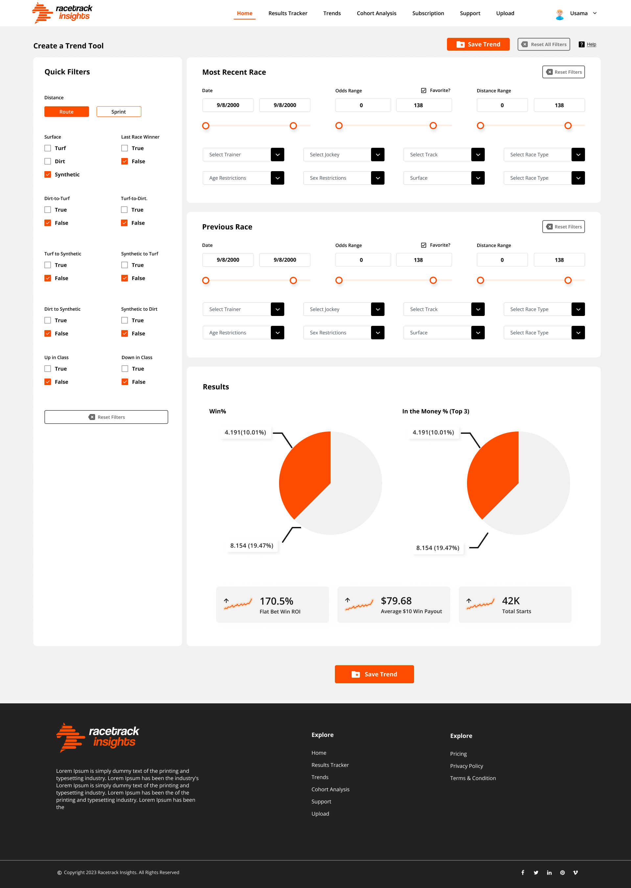

# Race Track Dashboard



An organized project structure for Race Track app with React and Tailwind equipped with necessary additions such as
customizable common components.

React version: 17.0.2
<br>
Tailwind version: 3.0.5

# Template Content

- common components: Button, Dropdown, Checkbox, Card.
- 404 page.
- Routing setup
- Tailwind Layers

## Getting Started

Install Dependencies

```bash
npm install
```

Then, run the development server:

```bash

npm start
```
